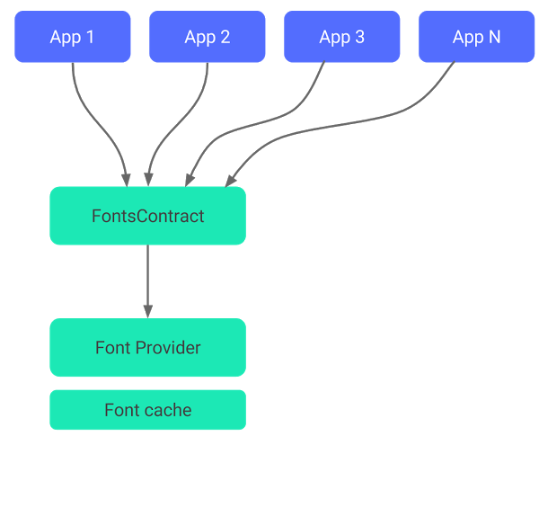

# 利用兼容库支持可下载字体

在2017年的Google I/O大会上，对于开发者来说以令人激动的消息是，从Android O开始，Android系统开始支持自定义的字体，同时，Android的兼容库也一直兼容到API 14。现在，你可以从[Google Fonts](https://fonts.google.com)的成千上万款字体中，为你的App选择一个最合适的字体。

那么记下来我们来说说使用[Downloadable Fonts（可下载字体）](https://developer.android.com/guide/topics/ui/look-and-feel/downloadable-fonts.html#adding-certificates)的优势。

## 可下载的字体的优势

你可以去看看Google官方的文档，附上链接[Downloadable Fonts（可下载字体）](https://developer.android.com/guide/topics/ui/look-and-feel/downloadable-fonts.html#adding-certificates)。

- 可下载的字体可以减小APK的体积。（因为你可以不用把.ttf/.otf这样的字体文件打包在你的APK中了。）
  > 这里附上一个文章，关于ttf与otf字体的比较。[otf/ttf/ttc格式字体的区别](https://jingyan.baidu.com/article/5d6edee2fe14f299eadeec1c.html)

- 同一台设备上的Apps可以从一个单一资源中共享字体，这种方式解决了因字体资源文件过多占用了用户过多的存储空间的问题。

对于原生支持的字体，Android系统尤其强调了第二点。来简单的看一下：



你可以看到，所有请求字体的Apps都会走到一个**Font Provider（字体提供者）**，而**Fonts Contract**指定一个**Font Provider**（也就说设备上的所有App都会通过FontsContract来找到一个Font Provider）。因此，如果一种字体已经被任意一个App（App X）请求过了，那么如果AppY再次请求的话就不会触发这个字体的下载任务了，而是使用在系统中缓存的字体文件。

什么是FontsContract？什么是FontsProvider？为什么不能在直接告诉Android给我一种字体，这样简单又直接呢？

字体文件是一种可执行的文件，Android系统必须提供一个安全的方法，这样就不会有恶意的代码嵌入到字体文件中而被系统执行，这是一种防护安全的手段。

感谢的是，现在这种实现方式是非常简答的。让我们编码看看。

首先呢，需要在我们的模块中添加兼容库，添加到`build.gradle`文件中。
```
dependencies {
  compile 'com.android.support:support-compat:26.0.1'
}
```

如果你是使用的是Gradle的3.0 beta版本的插件，那么你应该使用`implementation`，而不是`compile`。

除此之外，兼容库已经被移动到Google的mave仓库下，而且你无须在使用SDk管理器去下载兼容库。为了将Google的仓库添加到你的App中，你需要打开`project`下的`build.gradle`文件：
```
repositories {
  google()
}
```

那么现在一切设置好了，我们开始添加字体吧。

随便找一个layout（布局）文件，这个布局文件中包含了一个TextView，那么我们现在给这个TextView添加字体。 我的文件是这样的：

```xml
<?xml version="1.0" encoding="utf-8"?>
<android.support.constraint.ConstraintLayout
    xmlns:android="http://schemas.android.com/apk/res/android"
    xmlns:app="http://schemas.android.com/apk/res-auto"
    xmlns:tools="http://schemas.android.com/tools"
    android:layout_width="match_parent"
    android:layout_height="match_parent"
    app:layout_behavior="@string/appbar_scrolling_view_behavior"
    tools:context="com.shaishavgandhi.samplefontcompat.MainActivity"
    tools:showIn="@layout/activity_main">

    <TextView
        android:id="@+id/newFont"
        android:layout_width="wrap_content"
        android:layout_height="wrap_content"
        android:text="Give me a new font!"
        android:textSize="20sp"
        app:layout_constraintBottom_toBottomOf="parent"
        app:layout_constraintLeft_toLeftOf="parent"
        app:layout_constraintRight_toRightOf="parent" 
        app:layout_constraintTop_toTopOf="parent"/>

    <TextView
        android:layout_width="wrap_content"
        android:layout_height="wrap_content"
        android:text="I still have old font!"
        android:textSize="20sp"
        app:layout_constraintLeft_toLeftOf="parent"
        app:layout_constraintTop_toBottomOf="@+id/newFont"
        app:layout_constraintRight_toRightOf="parent"/>

</android.support.constraint.ConstraintLayout>
```
一旦你进入了layout的设计（Design）模式，点击这个TextView然后滚动属性列表找到一个名字叫`fontFamily`的属性。


接下来，选择**More Fonts**，此时会弹出来一个对话框。


我们就在这里完成可下载字体的操作。看到这里列举出所有的下载的字体，你可以选择一个喜欢的去下载。我挑选了一个资源，名字是**Chelsea Market**。


这里一定要选择这个**Create downloadable font**，然后点击OK。

创建好之后会产生3个文件：

- 在`res/fonts`下的`chelsea_market.xml`
- 在`res/values`下的`font_certs.xml`
- 在`res/values`下的`preloaded_fonts.xml`

让我们来看看，它们之中都包含什么。

### chelsea_market.xml
```xml
<?xml version="1.0" encoding="utf-8"?>
<font-family xmlns:app="http://schemas.android.com/apk/res-auto"
        app:fontProviderAuthority="com.google.android.gms.fonts"
        app:fontProviderPackage="com.google.android.gms"
        app:fontProviderQuery="Chelsea Market"
        app:fontProviderCerts="@array/com_google_android_gms_fonts_certs">
</font-family>
```
这个文件给Android系统的字体提供了一个定义。正如你所看到的，它列举了**fontProvider**，**fontProviderCerts（字体提供者的证书）**等等内容，这都是由Android Studio创建的。

### font_certs.xml
```xml
<?xml version="1.0" encoding="utf-8"?>
<resources>
    <array name="com_google_android_gms_fonts_certs">
        <item>@array/com_google_android_gms_fonts_certs_dev</item>
        <item>@array/com_google_android_gms_fonts_certs_prod</item>
    </array>
    <string-array name="com_google_android_gms_fonts_certs_dev">
        <item>
            <!-- Huge string cert here -->
        </item>
    </string-array>
    <string-array name="com_google_android_gms_fonts_certs_prod">
        <item>
            <!-- Huge string cert here -->
        </item>
    </string-array>
</resources>
```
这个文件包含了在`ref/font/font_name.xml`文件中提到的那个证书。这个证书包含了一个很大的加密信息，来字体的可靠性。

###  preloaded_fonts.xml
```xml
<?xml version="1.0" encoding="utf-8"?>
<resources>
    <array name="preloaded_fonts" translatable="false">
        <item>@font/chelsea_market</item>
    </array>
</resources>
```
这个文件是Android Studio生成的，它用来帮助我们完成字体的预加载，当App启动的时候，字体的渲染不会产生延迟。布局的加载和渲染是同步的任务。首次渲染会花费那么一会时间这是因为Android系统在获得你需要的字体。如果将它声明在Manifest文件中，意味着在你的App启动的时候，Android系统就会开始获取字体了，而不是在视图（view）渲染的时候它需要某种字体时才去获取字体。

通过在**AndroidManifest.xml**中增加`meta-data`的标签来完成以上我们所描述的内容（如果你是通过Android Studio生成的下载的字体文件，那么它已经向AndroidManifest文件中添加过了）。

```xml
<meta-data android:name="preloaded_fonts"
  android:resource="@array/preloaded_fonts" />
```

现在，我们就可以给指定的TextView添加字体了。
```xml
<TextView
    android:id="@+id/newFont"
    android:layout_width="wrap_content"
    android:layout_height="wrap_content"
    android:fontFamily="@font/chelsea_market"
    android:text="Give me a new font!"
    android:textSize="20sp"
    app:layout_constraintBottom_toBottomOf="parent"
    app:layout_constraintLeft_toLeftOf="parent"
    app:layout_constraintRight_toRightOf="parent"
    app:layout_constraintTop_toTopOf="parent"/>
```

让我们将App运行起来看一下。


这太棒了。正如你看到的，我们给TextView添加了新的字体。然而，在多数情况下，你可能希望在整个App中更实用同一种字体，而不是给一个TextView之类的组件都来设置`fontFamily`。一个简答的办法就是在你的**styles.xml**中，将它添加到你系统的主题中。

```xml
<style name="AppTheme" parent="Theme.AppCompat.Light.DarkActionBar">
    <item name="colorPrimary">@color/colorPrimary</item>
    <item name="colorPrimaryDark">@color/colorPrimaryDark</item>
    <item name="colorAccent">@color/colorAccent</item>
    **<item name="android:fontFamily">@font/chelsea_market</item>**
</style>
```

然后在**AndroidManifest.xml**文件中：
```xml
<application
    android:allowBackup="true"
    android:icon="@mipmap/ic_launcher"
    android:label="@string/app_name"
    android:roundIcon="@mipmap/ic_launcher_round"
    android:supportsRtl="true"
    android:theme="@style/AppTheme">
```

这样的话，App中TextView就可以更换字体了。就是这样，那就来试试这个新的可下载字体，它可以减小的APK的大小，可以加载多种字体。很有趣哦！

## 说明

\#原文#  [Downloadable Fonts with Support Library](https://android.jlelse.eu/downloadable-fonts-with-support-library-31ba51848655)
\#作者#  Shaishav Gandhi
\#发布时间# 2017/08/20