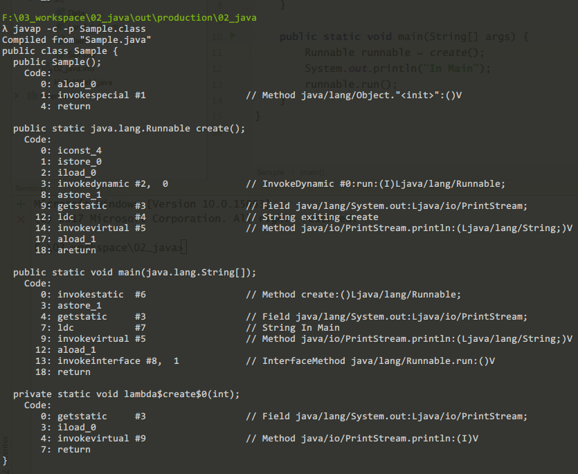

# 使用闭包（closure）去捕捉状态
**Lambda表达式是无状态的，但你的程序必须要有状态。**

> **#CommentsOnIt#**  
> 
> **#COMMENTS#** 这是一篇优秀的技术文章，它讲解了lambda的无状态和closure的有状态的因果。内容简洁扼要，不拖泥带水，点到为止。如果想了解闭包部分相关的技术内幕着实为一篇好文章。
>
> **#KEYWORDS#**  闭包、lambda表达式，状态、词汇范围  
> **#FROM#** Translated by Clever.S from [ZOOM.US](https://zoom.us)

在Java语言中，我们宽泛地使用lambda表达式来完成lambda表达式或者闭包（closure）。但是在一些情况下，理解它们（lambda/closure）的区别是十分重要的。lambda表达式是无状态的，而闭包（closure）是携带状态的。用闭包来代替lambda表达式去管理函数式程序是一种很优雅的方式。

## 无状态的生命

在这一些列的教学中，我们已经和lambda一起工作了很久，而且我们也越来越了解它们。它们（lambda表达式）是微小的匿名函数，这些函数会携带者一些参数，执行一些计算，也可能会返回一个结果。Lambda表达式是无状态的，这会在代码中产生一些有趣的影响。

让我们来看一个使用lambda表达式的简单例子。假设我们希望在一组数字中找到偶数，一种方式就是去创建一个函数式的管道（pipeline） ，我们使用`Stream`的lambda表达式，像如下这样：
```
numbers.stream()
  .filter(e -> e % 2 == 0)
  .map(e -> e * 2)
  .collect(toList());
```

我们传递到`filter`中的lambda表达式是一个`Predicate`的函数式接口，它会携带一个数字进去然后验证这个这数字，如果这个数字是偶数，那么就返回`true`，否则返回`false`。传递到`map`的参数是一个`Function`函数式接口，它会携带任何一个数字然后返回它两倍的值。

这些lambda表达式都依赖于传入的参数和常量值。它们都是独用的（self-contained），这意味着它们不会有任何的外部依赖。因为它们依赖传入的参数，可能是常量，所以lambda表达式是无状态的。它们可爱（cute），安静，就像打盹的小孩子。

> #CommentsOnIt#  
> 末尾这句“它们都是独用的（self-contained），这意味着它们不会有任何的外部依赖。因为它们依赖传入的参数，可能是常量，所以lambda表达式是无状态的。”我来补充一下我理解的意思：lambda表达式就认常量，其他的它并不关心。一旦拿到一个满足条件的常量，它就好像把自己封闭起来，与外部环境隔绝，所以说它是无状态的，因为常量哪有什么状态可言呢！

## 为什么我们需要状态

让我来深入地看一个lambda表达式，这个表达式是我们传入到`map`方法中的。
```
.map((e, factor) -> e * factor)
```
假设我们希望计算给定值`e`的`factor`倍数的结果，这个lambda表达式可以适用。但是很不巧，它实际上不可用。因为`map`方法接受一个函数式接口`Function<T, R>`，`T apply(R)`，我们可以理解为输入一个`R`，输出一个`T`。但lambda表达式的函数签名和`Function`的`apply`函数不一致，正因为多了一个参数`factor`，像`BiFunction<T, U, R>`，那就必须有其他的方法让`factor`进入这个lambda表达式中。

## 词汇范围
 函数期望一些变量在自己的范围内。因为它们是匿名函数，所以lambda需要引用的变量也在范围内。一些变量是作为参数被lambda表达式中的，另一些则直接定义在本地。同时，还有一些变量定义在函数外部，而外部环境被称为语义词汇范围（lexical scope）。
 
 这有一个例子来说明它。
 ```
 public static void print() {
   String location = "World";
   Runnable runnable = new Runnable {
       public void run() {
           System.out.println("Hello" + location);
       }
   }
 }
 ```
 
 在`print`方法中，`location`是一个局部变量。然而，这个`run`方法引用了这个`location`，这个参数既不是本地变量也不是`run`方法的变量。这个紧挨着`"Hello"`的`location`变量绑定到了`print`方法的`location`变量上。
 
 一个词汇范围（lexical scope）就是定义一个函数的范围。相反，它也可能是界定范围的界定范围。
 
 在之前的代码中，`run`方法没有定义`location`或者它没有接受`location`作为参数。`run`方法定义范围是一个`Runnable`的匿名内部类。因为`location`没有定义在`Runnable`的这个实例中，那么编译器会持续的向匿名内部类中进行搜索，也就是这个定义范围中的`print`方法。
 
 如果在定义范围内没有出现`location`，那么编译的查找也会持续的在`print`的定义范围内进行，直到变量找到或者查找失败。
 
 ## 在一个lambda表达式中的词汇范围
 
 现在我们来看看用lambda表达式重写上面的方法将会发生什么：
 ```
 public static void print() {
     String location = "World";
     Runnable r = () -> System.out.println("Hello" + location);
 }
 ```
 
 这段代码更加的简洁了，这要多亏了lambda表达式，但是对于`location`词汇范围和绑定是没有变化的。在lambda表达式内的`location`（就是`println`之中的`location`）绑定到了在lambda表达式词汇范围之中的`location`（就是`print()`函数的定义范围）变量上。严格地说，在这段代码中，lambda表达式就是一个闭包（closure）。
 
 ## 闭包（closure）是如何携带状态的
 
 lambda表达式不依赖于任何外部的内容；相反，他们是依赖于lambda表达式自己的参数和常量。另一方面，也依赖于他们词汇范围（lambda表达式的定义范围，如`print`）内的变量。
 
 从逻辑上讲，闭包绑定到了它们词汇范围内的变量。但是虽然逻辑上正确的，但是情况并非总是这样。有时候这样的绑定是不可能的。这里有两个场景会说明这一点。
 
 首先，如下这段代码传递了一个lambda表达式或者一个闭包（closure）到`call`方法中：
 ```
 class Sample {
     public static void call(Runnable runnable) {
         System.out.println("calling runnable");
         runnable.run();  // level 2 of stack
     }
     
     public static void main(String[] args) {
         int value = 4; // level 1 of stack
         call(() -> {
           System.out.println(value); // level 3 of stack
         });         
     }
 }
 ```
 在代码中的闭包（closure）使用了它词汇范围内的变量`value`。如果`main`方法的执行是在stack level 1中的，那么`call`方法的执行将会在stack level 2，因为`Runnable`的`run`方法是在`call`中调用的，那么闭包（closure）的执行将在stack level 3上。那么，如果这个闭包（closure）被再次被传递到其它的方法中（比如在`call`中作为参数被传递到其它的方法中），栈的层级将会变得更高。
 
 那么你可能会想，在一个栈层级上怎么能拿到前一个栈层级的变量的（ps：为栈分配的内存空间是非共享的）？尤其是也传递上下文（context）啊？简要的答案是：这是不能的。
 
 让我们来考虑另一个例子。
 ```
 class Sample {
     public static Runnable create() {
         int value = 4;
         Runnable r = () -> System.out.println(value);
         System.out.println("exiting create");
         return r;
     }
     
     public static void main(String[] args) {
         Runnable runnable = create();
         System.out.println("In Main");
         runnable.run();
     }
 }
 ```
 在这个例子中，`create`方法有一个局部变量`value`，这个局部变量的生命周期十分的短，只要一离开了`create`方法它就消失（回收）了。然而闭包（closure）在`create`被创建的时候在它的词汇范围（定义范围）引用了这个变量。在`main`方法中，当`create`方法结束后，`create`方法给它的调用者返回了这个闭包（closure）。在这个流程中，`value`最终从`create`方法中被移除，然后lambda表达式被执行，如下是输出结果：
> `exiting create`  
> `In Main`  
> `4`  

我们知道当`main`方法中调用`Runnable.run`方法的时候，在`create`方法中的`value`已经死亡了。当我们假设在lambda表达式中的`value`可能会直接绑定到lambda表达式的词汇范围（定义范围）内的那个`value`上，可这个假设是站不住脚的。

这有一个比如会解释它是如何工作的。

## 闭包的午休（lunch break）

假设我的办公室距离我的家里大约有10公里，而且我早上8点的时候起身去工作，正当中午的时候我有短时间去吃午饭，但是出于健康考虑，我更吃家里做的饭菜。考虑到午休时间短，只有我起身去工作的时候带着做好的饭菜才是可能的。

这正是闭包（closure）所做的事情：它们随身带着午餐（状态：state）。
说的深入一点，让我们再看一次`create`方法中的那个lambda表达式：
```
Runnable r = () -> System.out.pritln(value);
```

我们写的这个lambda表达式并没有带着任何它需要的参数。反编译这个`Sample`类，检查一下它的字节码。你会注意到编译器已经创建了一个方法给闭包（closure），而且这个方法带着一个`int`类型的参数：



现在我们来看看为`create`方法生成的字节码：
```
0: iconst_4
1: istore_0
2: iload_0
3: invokedynamic #2, 0   // InvokeDynamic #0:run(I)Ljava/lang/Runnable
```
**`value`4被存储到一个变量上，然后这个变量被加载且传递到为闭包（closure）创建的函数中。在这个例子中，闭包（closure）拿着`value`的是一份拷贝。**

这就是闭包（closure）如何携带状态的。

## 使用闭包

现在我们来重新回顾一下文章最开头的那个例子。要替代集合中偶数的倍数，或者是3倍，4倍呢？该怎么办？我们可以将原始的lambda表达式换成闭包（closure）。

这是原先的代码：
```
numbers.stream()
    .filter(e -> e % 2 == 0)
    .map(e -> e * 2)
    .collect(toList());
```

使用闭包来替换lambda表达式，代码是这样的：
```
int factor = 3;
numbers.stream()
    .filter(e -> e % 2 == 0)
    .map(e -> e * factor)
    .collect(toList());
```

取代了使用lambda表达式，这个`map`方法现在带着一个闭包（closure）做事。我们知道这个闭包（closure）正在接收一个参数`e`，但是它同样捕捉且携带了这个`factor`变量的状态。

这个变量在闭包（closure）的词汇范围（定义范围）内。它可能是定义lambda表达式的函数中的一个局部变量；它可以作为外部函数的一个参数；也可能会在定义闭包（closure）范围内的任何地方。无论怎样，闭包（closure）从定义闭包的代码到需要变量的执行点之间都携带着状态。

## 结论

闭包（closure）不同于lambda表达式在于：对于一些变量来说，闭包（closure）依赖于它们的词汇环境。作为结果，闭包可以捕捉和携带它们。**因为lambda表达式是无状态的，而闭包（closure）是有状态的。** 从定义闭包的上下文到它的执行中间，你可以在你的程序使用闭包来携带状态。

## 译文
1. 原地址：[PDF of this content](https://www.ibm.com/developerworks/library/j-java8idioms10/j-java8idioms10-pdf.pdf)
2. 原作者：Venkat Subramaniam (published on December 06, 2017)