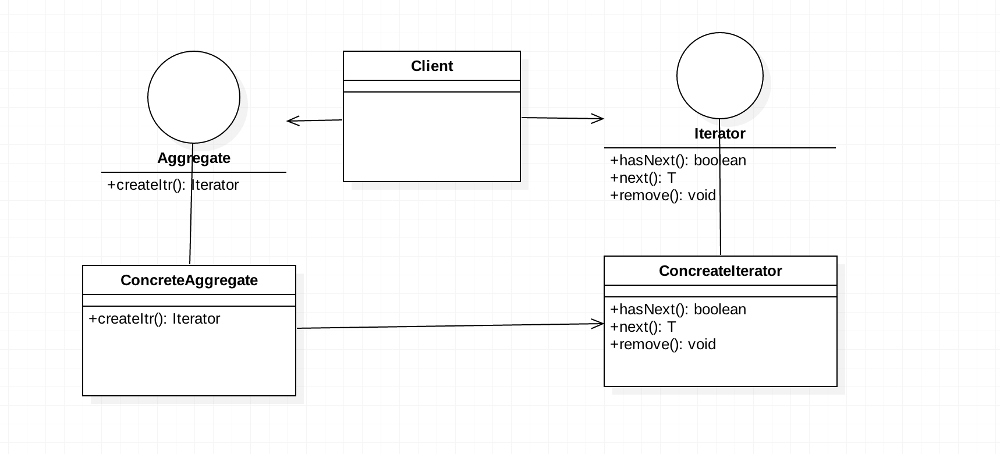
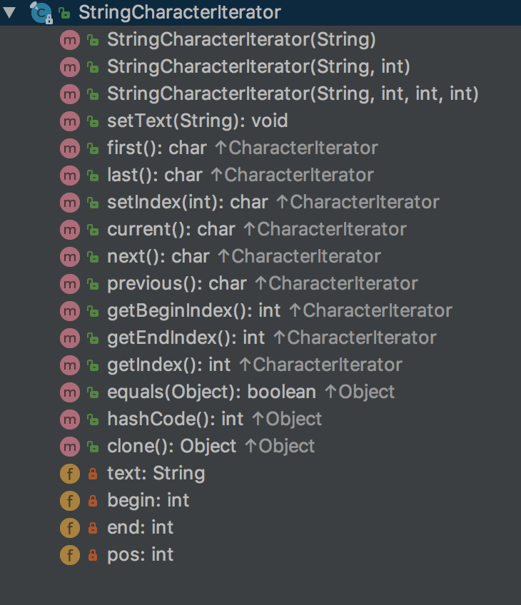
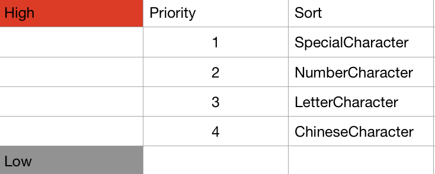
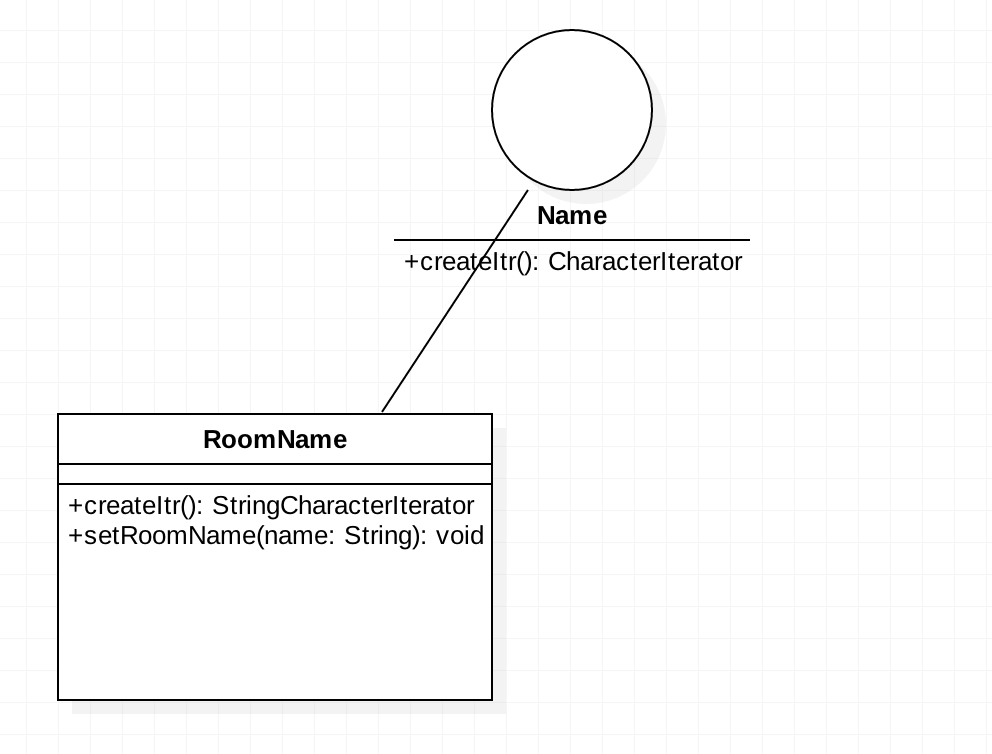

# Iterator与Comparator实战

## 前言
今天我想分享的内容是**Iterator**与**Comparator**，以及**方法局部类**这三个部分，需要强调的是，这三个部分没有任何直接的关系，只是我利用它们解决了实际项目的房间名称排序的问题，这是一次很好的尝试。记录，整理，反思，改进，这是对以前未敢尝试的技术点最好的处理方式。

闲话不多说，直接进入正题。

## 目录
- Iterator部分
- Comparator部分
- 方法内部类介绍以及应用
- 实战部分

## 1.Iterator部分
设计模式的出现以及使用都是为了更优雅、更灵活、成本更低的解决问题。**Iterator**就是这样的。

Iterator称作迭代器，主要的作用与其名字一样，迭代（遍历）一组数据。在Java中，Iterator是java.util包中的类，同时，它的出现与另一个对象密不可分，即**Collection**。Collection是一个抽象接口，概念也很好理解，即Collection表示这类接口的实现是有能力容纳一组类型的元素。有了集合（Collection）的出现，就可以利用它设计和完成更加复杂的任务。

Iterator是设计模式的一种。
> The Iterator Pattern provides a way to access the elements of an aggregate object sequentially without exposing its underlying representation.

**Iterator提供了一种连续访问元素的方式而不用暴露底层的表示**。那Iterator是如何做到这一点的？

刚刚提过，Iterator与Collection密不可分。


新版本的Iterator的实现增加了`default void forEachRemaining(Consumer<? super E>)`的默认实现，基础的函数有：
- `hasNext(): boolean`
- `next(): E`
- `remove(): void`

基础函数的具体含义，可以留心一下Java的API。`hasNext()`得到的`boolean`变量说明迭代器是否可以返回下一个元素；`next()`返回一个泛型类型为`E`的对象；`remove()`方法会删除掉iterator从集合中返回的最后一个元素。

有了这三个函数，迭代器的基础模型就完成了，我们可以利用迭代器完成一个Collection的迭代。Collection的在Java中可以表示为一个集合：


有了这三个类，就可以得知Iterator是如何完成迭代的。
首先，`Collection`接口拓展了`Iterable`接口，这个接口描述了一个对象是可迭代的（Iterable）。同样，任何一个实现了Iterable的接口都可以在for-each中做循环迭代的任务。实际上，在Java 1.5之后，新增加的for-each循环其实是这样的：
```Java
for(T t : Iterable<T>)

// iterate a list
for(Object obj : ArrayList) {
  ...
}
```
正如`Iterable`接口的doc说明的一样，任何实现了这个接口的对象都可以作为for-each循环的目标对象。因此，`Collection`接口实现了这个接口，例如`ArrayList`这样的实现就可以在for-each中实现迭代了。



这里先给出迭代器模式的整体的解构，在实战部分将会伴随具体的实现来阐述各个角色的作用和意义。

### 实战部分
接下来，我用实际的例子来说明，Iterator到底是如何完成工作的。
其实，在Java中，并不是所有需要遍历的对象都可以用`Iterator`来完成，换句话说，如果有需要，开发者完全可以自己根据需求来定义`Iterator`。在`java.text`的package中，`CharacterIterator`没有实现`java.util.Iterator`接口，这就是一个根据需求定义的一个迭代器。也是我解决问题的主角之一。

### 1. CharacterIterator
**1.1 什么是CharacterIterator？**

CharacterIterator是一个接口，正如前面所提到的，它并没有直接实现`java.util.Iterator`接口，而是一个完全自定义的迭代器。
> This interface defines a protocol for bidirectional iteration over text.

**这个接口定义了一个双向迭代文本的协议。**
简单的说，如果我们想迭代一个文本或者一段文字，例如在Java中，希望迭代`String`这样的字符串时，是无法直接利用`for-each`进行迭代的，因为`String`没有实现`Iterable<T>`接口，无法返回一个`iterator`进行迭代。

既然这样，我们依然想对一个`String`字符串的字符逐个迭代没有了更好的办法？答案是：NO！其实，从`String`类的设计出发，可以得出为什么它无法迭代且`CharacterIterator`被创造出来的理由，我们来对比一下`Collection`与`String`：

```Java
// String
public final class String implements java.io.Serializable, Comparable<String>, CharSequence {
   
}

public interface CharSequence {
  
}

// Collection
public interface Collection<E> extends Iterable<E> {
  
}

```
看上面的代码段可以得知，`String`类没有实现`Iterable<E>`接口，而它实现的`CharSequence`也没有拓展`Iterable`接口，`Collection<E>`接口拓展了`Iterable<E>`，因此它的实现类一定要实现`Iterable<E>`中的`Iterator<T> iterator()`方法，返回了iterator就可以利用它进行迭代了，例如`ArrayList`。

虽然我们无法直接对`String`对象直接进行迭代，但是也并不是没有办法，`CharaterIterator`优雅地解决了这个问题。字符串由字符（char）组成，`CharacterIterator`的设计宗旨即迭代字符串中的字符，所以它是`Character-Iterator`。

`CharacterIterator`是接口，如果只是要迭代字符串，我们大可不必造轮子，在Java中已经融入了一个字符串的迭代器，就是`StringCharacterIterator`。那么结合上面给出的迭代器设计模式中的结果图：
- `CharacterIterator` 就是Iterator的角色充当
- `StringCharacterIterator` 就是ConcreteIterator的角色充当


粗略地过一遍`CharacterIterator`接口提供的API：


1. `first():char`返回第一个`char`类型的字符
2. `last():char`返回最后一个`char`类型的字符
3. `current():char`返回游标当前指向的那个`char`类型的字符
4. `next():char`返回新位置上的`char`类型的字符或者`DONE`字符
5. `DONE:char = \uFFFF` 表示索引到末尾的完成字符，通常用于校验

其实迭代器想要完成的任务就是将一组给定的元素集合做遍历相关的任务，所以以上给出的5个的方法和常量就可以组成一个基本的迭代器。


1.2 **什么是StringCharacterIterator？**



`StringCharacterIterator`是`CharacterIterator`的实现：
```Java
public final class StringCharacterIterator implements CharacterIterator {
    private String text;
    ...
    
    public StringCharacterIterator(String text) {
        if (text == null)
            throw new NullPointerException();
        this.text = text;

        if (begin < 0 || begin > end || end > text.length())
            throw new IllegalArgumentException("Invalid substring range");

        if (pos < begin || pos > end)
            throw new IllegalArgumentException("Invalid position");

        this.begin = begin;
        this.end = end;
        this.pos = pos;
    }
    
    public void setText(String text) {
        if (text == null)
            throw new NullPointerException();
        this.text = text;
        this.begin = 0;
        this.end = text.length();
        this.pos = 0;
    }
    
    public char first() {
        pos = begin;
        return current();
    }
    
    public char last() {
        if (end != begin)
            pos = end - 1;
        else 
            pos = end;
        return current();
    }
}
```
`StringCharacterIterator`提供了一个`text`的域，在构造器和`setText(String text)`方法中，都可以对`text`进行设置。`ChacaterIterator`定了双向迭代文本的协议，因此，`first()`和`last()`是双向迭代的起点。

接下来的部分我们来实战一下，如何使用它们解决实际问题。

**1.3 实际问题解析**

在实际问题中，有这样的一个需求，将房间（Room）的名称进行排序，排序不同于往常的根据字母表排序，我们实际业务的排序有一定的要求，特殊字符优先，数字开头其次，英文字符开头其次，最后是中文字符。如果两个字符串的字符单位相同，那么向后递归比较，优先级依然遵从下面的规则。如果两个字符串相同长度部分相同，以短优先。



简单归纳一下规则：  
1. 首字符排序优先级根据上表规则来定。
2. 字符相同，向后递归，优先级同上。
3. 长度相同部分完全相同，以短串优先显示。
4. 可能存在大小写转换的需求。

> 声明在先：
> 学习优先，能力优先。如果有更加的快捷，效率更高的方法，请不吝赐教。

**1.4 解决问题**

在拿到这个Task之前，我快速的在脑袋里搜了一圈，我可能会用到的方法和手段，如果直接上手写可能也会将这个Task做出来，不过我依然希望自己可以在学过的内容中找到一些更好的解决方式。我很快想到了Iterator的迭代器模式，不过正如前面分析的一样，`String`无法直接进行迭代，如果利用`String.toCharArray()`得到一个`char[]`的数组，然后利用`for-each`完成迭代，也未尝不可。
```Java
String cleverRoomName = "Clever's Chatting Room";
String simonRoomName = "Simon's Video Room";
for (char item : cleverRoomName.toCharArray()) {
    process(item);
}
```
最开始我的脑海里想到的就是这种方法，并且逐步的实现了一下，其实，如果我们只是针对单个字符进行逐一处理的话，`for-each`效率更高，逻辑更简单。但是，如果我们需要增加迭代的不仅是房间名称，而且有其他规则的其他属性，那么`for-each`就不太胜任了，可能会针对不同的属性和规则有不同的实现，换句话说，我们需要让这部分稍微具有通用性且是可拓展的。

另外，**我倾向于使用`CharacterIterator`的另一个原因，就是我之前没有用过，我想尝试。**

首先，问题已经描述清楚了，那么开始**划分职责并且设计角色**。既然选择了利用迭代器模式，那么根据上面我们给出的**Iterator Diagram**划分职责。

- `Iterator`部分: 由`CharacterIterator`充当，它是`java.text`包中的成员，所以我们无需造轮子。


- `ConcreteIterator`部分：由`StringCharacterIterator`充当，它是`java.text`中的一员，无需造轮子，直接使用。

- `Aggregate`部分：为了让任何名字（属性无关），如人员姓名，房间名称，备注名等可以进行迭代，这里建立一个接口，它的职责就是用来生成`CharacterIterator`迭代器，命名为`Name`接口。

 `ConcreteAggragate`部分：它是`Name`接口的实现类，它需要实现接口方法以生成迭代器，并且需要组合一个真正的`String`对象提供迭代的原始数据，也就是真实业务中的`RoomName`。
 
 接着，开始**设计角色**。我在设计角色的时候，就是完成角色类的设计。
 
 
 ```Java
 // Name.java
 public interface Name {
     CharacterIterator createItr();
 }
 
 // RoomName.java
 public class RoomName implements Name {
     private String name;
     
     public RoomName() {
         // nothing
     }
     
     pubilc RoomName(String name) {
         Objects.requireNonNull(name);
         this.name = name;
     }
     
     public void setRoomName(String name) {
         Objects.requireNonNull(name);
         this.name = name;
     }
     
     @Override
     public CharacterIterator createItr() {
         return new StringCharacterIterator(this.name);
     }
 }
 ```