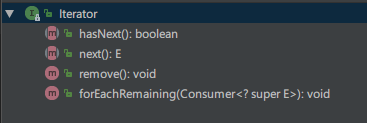
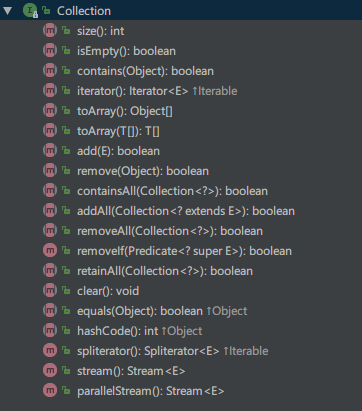
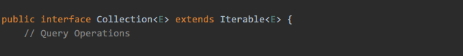
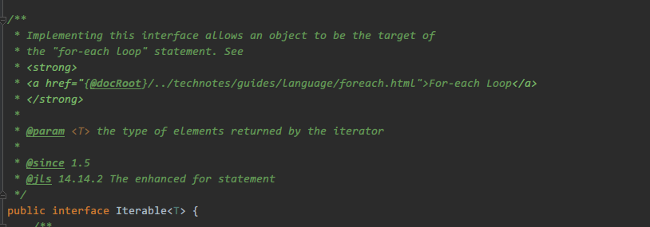
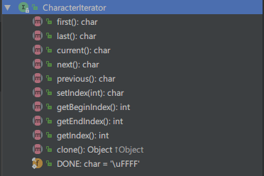

# Iterator与Comparator实战

## 前言
今天我想分享的内容是**Iterator**与**Comparator**，以及**方法局部类**这三个部分，需要强调的是，这三个部分没有任何直接的关系，只是我利用它们解决了实际项目的房间名称排序的问题，这是一次很好的尝试。记录，整理，反思，改进，这是对以前未敢尝试的技术点最好的处理方式。

闲话不多说，直接进入正题。

## 目录
- Iterator部分
- Comparator部分
- 方法内部类介绍以及应用
- 实战部分

## 1.Iterator部分
设计模式的出现以及使用都是为了更优雅、更灵活、成本更低的解决问题。**Iterator**就是这样的。

Iterator称作迭代器，主要的作用与其名字一样，迭代（遍历）一组数据。在Java中，Iterator是java.util包中的类，同时，它的出现与另一个对象密不可分，即**Collection**。Collection是一个抽象接口，概念也很好理解，即Collection表示这类接口的实现是有能力容纳一组类型的元素。有了集合（Collection）的出现，就可以利用它设计和完成更加复杂的任务。

Iterator是设计模式的一种。
> The Iterator Pattern provides a way to access the elements of an aggregate object sequentially without exposing its underlying representation.

**Iterator提供了一种连续访问元素的方式而不用暴露底层的表示**。那Iterator是如何做到这一点的？

刚刚提过，Iterator与Collection密不可分。



新版本的Iterator的实现增加了`default void forEachRemaining(Consumer<? super E>)`的默认实现，基础的函数有：
- `hasNext(): boolean`
- `next(): E`
- `remove(): void`

基础函数的具体含义，可以留心一下Java的API。`hasNext()`得到的`boolean`变量说明迭代器是否可以返回下一个元素；`next()`返回一个泛型类型为`E`的对象；`remove()`方法会删除掉iterator从集合中返回的最后一个元素。

有了这三个函数，迭代器的基础模型就完成了，我们可以利用迭代器完成一个Collection的迭代。Collection的在Java中可以表示为一个集合：






有了这三个类，就可以得知Iterator是如何完成迭代的。
首先，`Collection`接口拓展了`Iterable`接口，这个接口描述了一个对象是可迭代的（Iterable）。同样，任何一个实现了Iterable的接口都可以在for-each中做循环迭代的任务。实际上，在Java 1.5之后，新增加的for-each循环其实是这样的：
```Java
for(T t : Iterable<T>)

// iterate a list
for(Object obj : ArrayList) {
  ...
}
```
正如`Iterable`接口的doc说明的一样，任何实现了这个接口的对象都可以作为for-each循环的目标对象。因此，`Collection`接口实现了这个接口，例如`ArrayList`这样的实现就可以在for-each中实现迭代了。

### 实战部分
接下来，我用实际的例子来说明，Iterator到底是如何完成工作的。
其实，在Java中，并不是所有需要遍历的对象都可以用`Iterator`来完成，换句话说，如果有需要，开发者完全可以自己根据需求来定义`Iterator`。在`java.text`的package中，`CharacterIterator`没有实现`java.util.Iterator`接口，这就是一个根据需求定义的一个迭代器。也是我解决问题的主角之一。

粗略地过一遍`CharacterIterator`接口提供的API：


1. `first():char`返回第一个`char`类型的字符
2. `last():char`返回最后一个`char`类型的字符
3. `current():char`返回游标当前指向的那个`char`类型的字符
4. `next():char`返回新位置上的`char`类型的字符或者`DONE`字符
5. `DONE:char = \uFFFF` 表示索引到末尾的完成字符，通常用于校验

其实迭代器想要完成的任务就是将一组给定的元素集合做遍历相关的任务，所以以上给出的5个的方法和常量就可以组成一个基本的迭代器。


在实际问题中，有这样的一个需求，将房间（Room）的名称进行排序，排序不同于往常的根据字母表排序，我们实际业务的排序有一定的要求，特殊字符优先，数字开头其次，英文字符开头其次，最后是中文字符。
