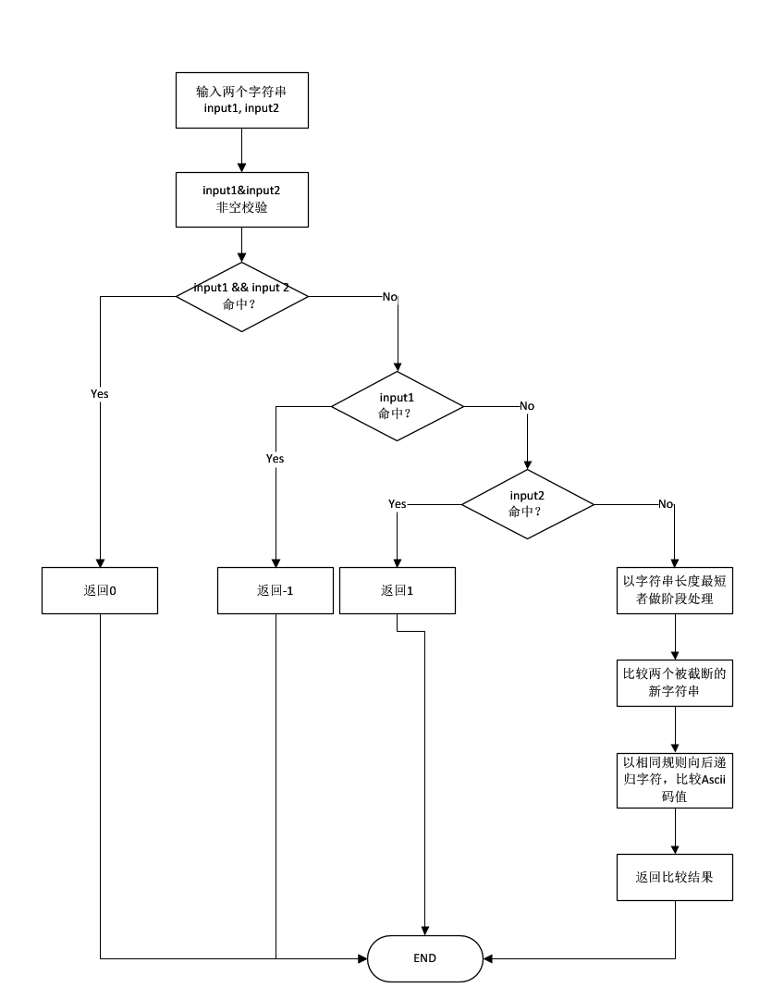

# 迭代器模式解决排序问题的实战

## 前言
今天我想分享的内容是**Iterator**与**Comparator**，以及**局部内部类**这三个部分，需要强调的是，这三个部分没有任何直接的关系，只是我利用它们解决了实际项目的名称排序的问题，这是一次很好的尝试。

记录，整理，反思，改进，这是对以前未敢尝试的技术点最好的处理方式。

闲话不多说，直接进入正题。

## 目录
- Iterator部分
- Comparator部分
- 局部内部类部分
- 总结

## 1.Iterator部分
设计模式的出现以及使用都是为了更优雅、更灵活、成本更低的解决问题。**Iterator**就是这样的。

Iterator称作迭代器，主要的作用与其名字一样，迭代（遍历）一组数据。在Java中，`Iterator`是`java.util`包中的类，同时，它的出现与另一个对象密不可分，即`Collection`。`Collection`是一个抽象接口，概念也很好理解，即`Collection`表示这类接口的实现是有能力容纳一组类型的元素。有了集合（Collection）的出现，就可以利用它设计和完成更加复杂的任务。

Iterator是设计模式的一种。
> The Iterator Pattern provides a way to access the elements of an aggregate object sequentially without exposing its underlying representation.

**Iterator提供了一种连续访问元素的方式而不用暴露底层的表示**。那`Iterator`是如何做到这一点的？

刚刚提过，`Iterator`与`Collection`密不可分。


新版本的Iterator的实现增加了`default void forEachRemaining(Consumer<? super E>)`的默认实现，基础的函数有：
- `hasNext(): boolean`
- `next(): E`
- `remove(): void`

基础函数的具体含义，可以留心一下Java的API。`hasNext()`得到的`boolean`变量说明迭代器是否可以返回下一个元素；`next()`返回一个泛型类型为`E`的对象；`remove()`方法会删除掉iterator从集合中返回的最后一个元素。

有了这三个函数，迭代器的基础模型就完成了，我们可以利用迭代器完成一个`Collection`的迭代。`Collection`的在Java中可以表示为一个集合：


有了这三个类，就可以得知`Iterator`是如何完成迭代的。
首先，`Collection`接口拓展了`Iterable`接口，这个接口描述了一个对象是可迭代的（Iterable）。同样，任何一个实现了`Iterable`的接口都可以在`for-each`中做循环迭代的任务。实际上，在Java 1.5之后，新增加的`for-each`循环其实是这样的：
```Java
for(T t : Iterable<T>)

// iterate a list
for(Object obj : ArrayList) {
  ...
}
```
正如`Iterable`接口的doc说明的一样，任何实现了这个接口的对象都可以作为for-each循环的目标对象。因此，`Collection`接口实现了这个接口，例如`ArrayList`这样的实现就可以在for-each中实现迭代了。


这里先给出迭代器模式的整体的结构，在实战部分将会伴随具体的实现来阐述各个角色的作用和意义。

### 实战部分
接下来，我用实际的例子来说明，`Iterator`到底是如何完成工作的。
其实，在Java中，并不是所有需要遍历的对象都可以用`Iterator`来完成，换句话说，如果有需要，开发者完全可以自己根据需求来定义`Iterator`。在`java.text`的package中，`CharacterIterator`没有实现`java.util.Iterator`接口，这就是一个根据需求定义的一个迭代器。也是我解决问题的主角之一。

### 1. CharacterIterator
**1.1 什么是CharacterIterator？**

CharacterIterator是一个接口，正如前面所提到的，它并没有直接实现`java.util.Iterator`接口，而是一个完全自定义的迭代器。
> This interface defines a protocol for bidirectional iteration over text.

**这个接口定义了一个双向迭代文本的协议。**
简单的说，如果我们想迭代一个文本或者一段文字，例如在Java中，希望迭代`String`这样的字符串时，是无法直接利用`for-each`进行迭代的，因为`String`没有实现`Iterable<T>`接口，无法返回一个`iterator`进行迭代。

既然这样，我们依然想对一个`String`字符串的字符逐个迭代没有了更好的办法？答案是：NO！其实，从`String`类的设计出发，可以得出为什么它无法迭代且`CharacterIterator`被创造出来的理由，我们来对比一下`Collection`与`String`：

```Java
// String
public final class String implements java.io.Serializable, Comparable<String>, CharSequence {
   
}

public interface CharSequence {
  
}

// Collection
public interface Collection<E> extends Iterable<E> {
  
}

```
看上面的代码段可以得知，`String`类没有实现`Iterable<E>`接口，而它实现的`CharSequence`也没有拓展`Iterable`接口，`Collection<E>`接口拓展了`Iterable<E>`，因此它的实现类一定要实现`Iterable<E>`中的`Iterator<T> iterator()`方法，返回了iterator就可以利用它进行迭代了，例如`ArrayList`。

虽然我们无法直接对`String`对象直接进行迭代，但是也并不是没有办法，`CharaterIterator`优雅地解决了这个问题。字符串由字符（char）组成，`CharacterIterator`的设计宗旨即迭代字符串中的字符，所以它是`Character-Iterator`。

`CharacterIterator`是接口，如果只是要迭代字符串，我们大可不必造轮子，在Java中已经融入了一个字符串的迭代器，就是`StringCharacterIterator`。那么结合上面给出的迭代器设计模式中的结果图：
- `CharacterIterator` 就是Iterator的角色充当
- `StringCharacterIterator` 就是ConcreteIterator的角色充当


粗略地过一遍`CharacterIterator`接口提供的API：


1. `first():char`返回第一个`char`类型的字符
2. `last():char`返回最后一个`char`类型的字符
3. `current():char`返回游标当前指向的那个`char`类型的字符
4. `next():char`返回新位置上的`char`类型的字符或者`DONE`字符
5. `DONE:char = \uFFFF` 表示索引到末尾的完成字符，通常用于校验

其实迭代器想要完成的任务就是将一组给定的元素集合做遍历相关的任务，所以以上给出的5个的方法和常量就可以组成一个基本的迭代器。


1.2 **什么是StringCharacterIterator？**


`StringCharacterIterator`是`CharacterIterator`的实现：
```Java
public final class StringCharacterIterator implements CharacterIterator {
    private String text;
    ...
    
    public StringCharacterIterator(String text) {
        if (text == null)
            throw new NullPointerException();
        this.text = text;

        if (begin < 0 || begin > end || end > text.length())
            throw new IllegalArgumentException("Invalid substring range");

        if (pos < begin || pos > end)
            throw new IllegalArgumentException("Invalid position");

        this.begin = begin;
        this.end = end;
        this.pos = pos;
    }
    
    public void setText(String text) {
        if (text == null)
            throw new NullPointerException();
        this.text = text;
        this.begin = 0;
        this.end = text.length();
        this.pos = 0;
    }
    
    public char first() {
        pos = begin;
        return current();
    }
    
    public char last() {
        if (end != begin)
            pos = end - 1;
        else 
            pos = end;
        return current();
    }
}
```
`StringCharacterIterator`提供了一个`text`的域，在构造器和`setText(String text)`方法中，都可以对`text`进行设置。`ChacaterIterator`定了双向迭代文本的协议，因此，`first()`和`last()`是双向迭代的起点。

接下来的部分我们来实战一下，如何使用它们解决实际问题。

**1.3 实际问题解析**

在实际问题中，有这样的一个需求，将房间（Room）的名称进行排序，排序不同于往常的根据字母表排序，我们实际业务的排序有一定的要求，特殊字符优先，数字开头其次，英文字符开头其次，最后是中文字符。如果两个字符串的字符单位相同，那么向后递归比较，优先级依然遵从下面的规则。如果两个字符串相同长度部分相同，以短优先。


简单归纳一下规则：  
1. 首字符排序优先级根据上表规则来定。
2. 字符相同，向后递归，优先级同上。
3. 长度相同部分完全相同，以短串优先显示。
4. 可能存在大小写转换的需求。

> 声明在先：
> 学习优先，能力优先。如果有更加的快捷，效率更高的方法，请不吝赐教。

**1.4 解决问题**

在拿到这个Task之前，我快速的在脑袋里搜了一圈，我可能会用到的方法和手段，如果直接上手写可能也会将这个Task做出来，不过我依然希望自己可以在学过的内容中找到一些更好的解决方式。我很快想到了Iterator的迭代器模式，不过正如前面分析的一样，`String`无法直接进行迭代，如果利用`String.toCharArray()`得到一个`char[]`的数组，然后利用`for-each`完成迭代，也未尝不可。
```Java
String cleverRoomName = "Clever's Chatting Room";
String simonRoomName = "Simon's Video Room";
for (char item : cleverRoomName.toCharArray()) {
    process(item);
}
```
最开始我的脑海里想到的就是这种方法，并且逐步的实现了一下，其实，如果我们只是针对单个字符进行逐一处理的话，`for-each`效率更高，逻辑更简单。但是，如果我们需要增加迭代的不仅是房间名称，而且有其他规则的其他属性，那么`for-each`就不太胜任了，可能会针对不同的属性和规则有不同的实现，换句话说，我们需要让这部分稍微具有通用性且是可拓展的。

另外，**我倾向于使用`CharacterIterator`的另一个原因，就是我之前没有用过，我想尝试。**

首先，问题已经描述清楚了，那么开始**划分职责并且设计角色**。既然选择了利用迭代器模式，那么根据上面我们给出的**Iterator Diagram**划分职责。

- `Iterator`部分: 由`CharacterIterator`充当，它是`java.text`包中的成员，所以我们无需造轮子。


- `ConcreteIterator`部分：由`StringCharacterIterator`充当，它是`java.text`中的一员，无需造轮子，直接使用。

- `Aggregate`部分：为了让任何名字（属性无关），如人员姓名，房间名称，备注名等可以进行迭代，这里建立一个接口，它的职责就是用来生成`CharacterIterator`迭代器，命名为`Name`接口。

 - `ConcreteAggragate`部分：它是`Name`接口的实现类，它需要实现接口方法以生成迭代器，并且需要组合一个真正的`String`对象提供迭代的原始数据，也就是真实业务中的`RoomName`。
 
 接着，开始**设计角色**。我在设计角色的时候，就是完成角色类的设计。
 
 
 ```Java
 // Name.java
 public interface Name {
     CharacterIterator createItr();
 }
 
 // RoomName.java
 public class RoomName implements Name {
     private String name;
     
     public RoomName() {
         // nothing
     }
     
     public RoomName(String name) {
         Objects.requireNonNull(name);
         this.name = name;
     }
     
     public void setRoomName(String name) {
         Objects.requireNonNull(name);
         this.name = name;
     }
     
     @Override
     public CharacterIterator createItr() {
         return new StringCharacterIterator(this.name);
     }
 }
 ```
 
 目前为止，我们已经准备了迭代器所需要的大部分内容，最后，需要一个`Client`来将它们组合起来。Client要完成的任务就是根据需求，来定义该如何使用迭代器。
 
 ## 2. Comparator部分
 
 Comparator部分，我不想介绍的太多，点到为止即可。
 
 **2.1 什么是Comparator？**
 
`Comparator`依然封装在`java.util`包，它要完成的任务就是两个字：“**比较**”。
```Java
public class Comparator<T> {
    int compare(T o1, T o2);
    
    ...
}
```
`Comparator`接口的核心就是`int compare(T, T)`，将两个`T`类型的对象进行比较，并且返回一个`int`值作为比较的结果：
- retVal < 0 ：o1小于o2
- retVal = 0 ：o1等于o2
- retVal > 0 ：o1大于o2

**2.2 如何使用Comparator？**

这个小节中，我们将使用`Comparator`完成Client的角色充当，这里将会演示如何使用它以及角色扮演。

两个字符串类型的名字要进行比较，需要用到`Comparator`，而因为需求需要逐个字符比较，所以，`Comparator`与`Iterator`直接建立了连接，请注意：**`Comparator`与`Iterator`没有直接的关系，只是需求趋势，让它们协作完成任务，请不要被文章标题误导**。

`Comparator`可以直接使用，给出一个简单的示例：
```Java
List<Integer> numbers = Arrays.asList(8, 2, 1, 9, 0);
Collections.sort(numbers, new Comparator() {
    @Override
    public int compare(Integer f, Integer l) {
        return f - l;
    }
});
```

这里，我将Client的角色命名为`RoomNameComparator`，泛型类型`T`由实际的记录房间信息的`RoomInfo`来替换，虽然我在前面没有提到，为了保护信息，只需要知道`RoomInfo`只提供了需要的房间名（`DisplayName`）。

根据前面迭代器模式的设计，我们需要在Client中组合`Aggregate`对象，因为有了`Aggregate`对象我们就可以创建出`Iterator`来进行迭代。所以，在`RoomNameComparator`这个Client中组合`RoomName`的对象与`StringCharacterIterator`对象。

```Java
public class RoomNameComparator implements Comparator<RoomInfo> {
  
   // first room name iterator
   private static CharacterIterator fItr;
   
   // second room name iterator
   private static CharacterIterator lItr;
   
   // static initialization about creating two RoomName instances.
   static {
       fItr = new RoomName("").createItr(); 
       lItr = new RoomName("").createItr();
   }
   
   @Override
   public int compare(RoomInfo lhs, RoomInfo rhs) {
       if (lhs == rhs)
           return 0;
           
       String f = lhs.getDisplayName();
       String l = rhs.getDisplayName();   
       
       return compare(f, l);
   }
   
   private int compare(String s1, String s2) {
       // ...
   }
}
```

截至到当前节点，房间名排序的整体框架已经建立起来了，使用很简单：
```Java
Collections.sort(roomList, new RoomComparator());
```

将`RoomComparator`的实例作为`Collections.sort()`方法第二个参数传递进去，就可以完成排序了。接下来，我将演示如何进行排序的一些细节以及排序的需求实现。

在此之前，我们需要为`RoomInfo`的业务处理构建一个业务控制器，简单命名为`RoomInfoController`，里面定义几个处理`RoomInfo`列表的方法。

```Java
public final class RoomInfoController {
    
    private RoomNameComparator comparator;
    
    public RoomInfoController() {
        comparator = new RoomNameComparator();
    }
    
    public static void sort(List<RoomInfo> roomInfoList) {
        if (roomInfoList == null || roomInfoList.isEmpty())
            return;

        Collections.sort(roomInfoList, comparator);
    }
    
    public static void preProcess(List<RoomInfo> roomInfoList) {
        /*
            null-checking
         */
        if (roomList == null || roomList.isEmpty()) {
            return;
        }

        /*
            Initial
         */
        List<RoomInfo> tmp = new ArrayList<>(roomList);
        List<RoomInfo> digitStartRooms = new ArrayList<>();
        List<RoomInfo> specialStartRooms = new ArrayList<>();
        List<RoomInfo> chineseStartRooms = new ArrayList<>();
        List<RoomInfo> letterStartRooms = new ArrayList<>();

        /*
            Classify.
         */
        for (RoomInfo item : tmp) {
            if (!item.getDisplayName().isEmpty()) {
                String dn = item.getDisplayName();
                char firstChar = dn.charAt(0);
                if (isSpecialChar(firstChar))
                    specialStartRooms.add(item);
                else if (isDigit(firstChar))
                    digitStartRooms.add(item);
                else if (isChineseCharacter(firstChar))
                    chineseStartRooms.add(item);
                else if (isLetter(firstChar))
                    letterStartRooms.add(item);
            }
        }

        /*
            release resources.
         */
        tmp.clear();
        roomList.clear();

        /*
            add these conditional rooms to respective container.
         */
        if (!specialStartRooms.isEmpty()) {
            sort(specialStartRooms);
            roomList.addAll(specialStartRooms);
        }

        if (!digitStartRooms.isEmpty()) {
            sort(digitStartRooms);
            roomList.addAll(digitStartRooms);
        }

        if (!chineseStartRooms.isEmpty()) {
            sort(chineseStartRooms);
            roomList.addAll(chineseStartRooms);
        }

        if (!letterStartRooms.isEmpty()) {
            processWithLetterStarts(letterStartRooms);
            roomList.addAll(letterStartRooms);
        }

        /*
            release resources.
         */
        specialStartRooms.clear();
        digitStartRooms.clear();
        chineseStartRooms.clear();
        letterStartRooms.clear();
    }
    
    /**
     * Judge the c of char is a digit or not.
     * Added by Clever.Su on 2017/09/06.
     */
    private static boolean isDigit(char c) {
        return Character.isDigit(c);
    }

    /**
     * Check a char is Chinese or not.
     * Added by Clever.Su on 2017/09/06.
     *
     * @param c checked char
     * @return true is Chinese char otherwise false
     */
    private static boolean isChineseCharacter(char c) {
        Character.UnicodeBlock ub = Character.UnicodeBlock.of(c);
        return ub == Character.UnicodeBlock.CJK_UNIFIED_IDEOGRAPHS || ub == Character.UnicodeBlock.CJK_COMPATIBILITY_IDEOGRAPHS
                || ub == Character.UnicodeBlock.CJK_UNIFIED_IDEOGRAPHS_EXTENSION_A || ub == Character.UnicodeBlock.CJK_UNIFIED_IDEOGRAPHS_EXTENSION_B
                || ub == Character.UnicodeBlock.CJK_SYMBOLS_AND_PUNCTUATION || ub == Character.UnicodeBlock.HALFWIDTH_AND_FULLWIDTH_FORMS
                || ub == Character.UnicodeBlock.GENERAL_PUNCTUATION;
    }

    /**
     * Check a char is letter or not.
     * Added by Clever.Su on 2017/09/06.
     *
     * @param c checked char
     * @return true char is a letter otherwise false.
     */
    private static boolean isLetter(char c) {
        return Character.isLetter(c);
    }

    /**
     * Check a char is special char or not.
     *
     * @param c checked char
     * @return true is a special char like *\#\ otherwise false
     */
    private static boolean isSpecialChar(char c) {
        return !isDigit(c) && !isLetter(c) && !isChineseCharacter(c);
    }

    /**
     * Check a char is upper case or not.
     *
     * @param c checked char
     * @return true is a upper case char otherwise false
     */
    private static boolean isUpper(char c) {
        return Character.isUpperCase(c);
    }
}
```

OK，有了上述的控制器，我们开始处理第一个业务逻辑：
1. 首字符排序优先级根据上表规则来定。

为了解决这个需求，在控制器中增加了如下的方法：
- `isDigit(char c)`：字符是否为数字
- `isChineseCharacter(char c)`：字符是否为中文字符
- `isLetters(char c)`：字符是否为英文字符
- `isSpecialChar(char c)`：字符是否为特殊字符

在控制器的`preProcess()`方法中，利用这些方法将所有的`RoomInfo`采集到不同的`List`中，根据展示的先后分别`addAll()`，这样就完成了第一个需求。

接下来的第二个需求：

1. 长度相同部分完全相同，以短串优先显示。
2. 字符相同，向后递归，优先级同上。

这就要在`preProcess()`中进行处理，我的处理如下：


根据以上流程图，来实现`RoomNameComparator#compare(String, String)`的业务逻辑。
```Java
       /**
         * private compare to overload the method named compare() of Comparator.
         *
         * @param former the former string needs to be compared
         * @param latter the latter string needs to be compared
         * @return see {@link Comparator#compare(Object, Object)}
         */
        private int compare(String former, String latter) {
            if ((former == null || former.isEmpty()) && (latter == null || latter.isEmpty())) {
                return 0;
            }

            if (former == null || former.isEmpty())
                return -1;

            if (latter == null || former.isEmpty())
                return 1;

            int minLen = Math.min(former.length(), latter.length());
            boolean fGreaterL = former.length() > latter.length();
            String tF = former.length() == minLen ? former : former.substring(0, minLen);
            String tL = latter.length() == minLen ? latter : latter.substring(0, minLen);

            tfIter.setText(tF);
            tlIter.setText(tL);

            boolean isAllEqual = true;
            int compareRes = 0;
            char charTf = tfIter.first();
            char charTl = tlIter.first();

            while (charTf != CharacterIterator.DONE && charTl != CharacterIterator.DONE) {
                if (0 != compareChars(charTf, charTl)) {
                    isAllEqual = false;
                    compareRes = compareChars(charTf, charTl);
                    break;
                }

                charTf = tfIter.next();
                charTl = tlIter.next();
            }

            if (isAllEqual) {
                compareRes = fGreaterL ? -1 : 1;
            }

            return compareRes;
        }

        private int compareChars(char f, char l) {

            if (f != l && isLetter(f) && isLetter(l) && (isUpper(f) || isUpper(l))) {
                String fStr = (f + "").toLowerCase();
                String lStr = (l + "").toLowerCase();
                if (fStr.equalsIgnoreCase(lStr)) {
                    return f - l;
                }
            }

            if (f > l) return 1;
            if (f == l) return 0;
            if (f < l) return -1;
            return 0;
        }
    }
```

以上就是我给出的实现，需要注意一下几个细节：

如何利用`CharacterIterator`完成字符遍历：
------
```Java
// 将两个iterator的pos都指向起始位置
char charTf = tfIter.first();
char charTl = tlIter.first();

while (charTf != CharacterIterator.DONE && charTl != CharacterIterator.DONE) {
    if (0 != compareChars(charTf, charTl)) {
         isAllEqual = false;
         compareRes = compareChars(charTf, charTl);
         break;
    }
    // 当循环没有指向结束字符DONE时，iterator返回下一个元素并且pos加1，指向下一个位置
    charTf = tfIter.next();
    charTl = tlIter.next();
}
```

如何比较两个字符的大小？
------------
如果没有特殊的要求，我们可以直接利用`char`类型数据进行比较，比较的结果可以直接作为返回值，也是排序的结果。

## 3.局部内部类部分

**3.1 场景**

目前为止，第一部分和第二部分已经可以满足基本房间名称的排序问题。但是，对于英文字符开头的`RoomInfo`有些特殊的要求，即大小写放在一起，即如果有房间名称为`Tim's Room`和`tony's room`，它们应该以先后（大小写无关，只是排在一起）顺序显示出来，由于`T`与`t`的Ascii码值并不是排在一起的，所以我们需要单独的处理一下。

**3.2 处理**

搞明白了场景，我给出了一个解决方法，在以英文字符开头的房间名称要进行排序前，先要将名称转化为小写状态，转过过后在排序，之后再将原本为大写开头的房间名称恢复回去。总结一下，有一下几点：

1. 过滤所有以大写英文字符开头的房间名称
2. 将其转化为小写
3. 排序
4. 恢复为大写名称

您可能不禁会问，这和局部内部类有什么关系？我先简单的介绍一下，什么是局部内部类？

局部内部类是内部嵌套类的一种，在Java中，它常见于在一个方法中创建的类，例如：
```Java
public void foo() {
    class LocalInnerFoo {
        private String name;
    }
}
```
这个类的作用于很小，仅限于方法体内部可见，它也是闭包（Closure）形式的一种体现，由局部内部类创建的对象可以携带外层方法体中的一些信息，即使当外层方法结束，栈帧退出它依然可以保留方法的一些信息，这就是闭包的作用之一。

**3.3 实现**

有了以上的简单介绍，我可以利用局部内部类做一件事情，就是包裹`RoomInfo`，也就**Wrap**技术。**我包裹它的意义在于我想变化原始RoomInfo的信息（因为可能要进行房间名称的大写转换），但是在方法退出后我要恢复名称，让排序工作正常结束，不改变对象的状态。**

此时，局部内部类作用就很明显了！看看实现！
```Java
   /**
     * Sorted the list by alphabet.
     *
     * @param rooms rooms whose displayNames has the upper first character
     * @return a sorted list by alphabet
     */
    private List<RoomInfo> processWithLetterStarts(List<RoomInfo> rooms) {
        /*
            Inner class to wrap RoomInfo.
            Because I don't want to expose the details to outer class, so defines a method inner class here.
         */
        class RoomInfoWrapper {
            private RoomInfo roomInfo;
            private boolean isUpperFirstLetter;
            private String recoverDisplayName;
        }

        // 1. change all displayNames to lower cases
        List<RoomInfoWrapper> wrapperList = new ArrayList<>();
        for (RoomInfo item : rooms) {
            RoomInfoWrapper wrapper = new RoomInfoWrapper();
            wrapper.roomInfo = item;
            wrapper.recoverDisplayName = item.getDisplayName();
            wrapper.isUpperFirstLetter = isUpper(item.getDisplayName().charAt(0));
            if (wrapper.isUpperFirstLetter) {
                String firstUpperStr = (item.getDisplayName().charAt(0) + "").toLowerCase();
                item.setDisplayName(firstUpperStr.concat(item.getDisplayName().substring(1)));
            }
            wrapperList.add(wrapper);
        }

        // 2.sort list
        sort(rooms);

        // 3.recover the display name which has upper first letter.
        for (RoomInfoWrapper wrapper : wrapperList) {
            if (wrapper.isUpperFirstLetter) {
                wrapper.roomInfo.setDisplayName(wrapper.recoverDisplayName);
            }
        }

        // 4.release res.
        wrapperList.clear();

        // 5.return the sorted list.
        return rooms;
    }
```

大家看这段代码，在`processWithLetterStarts`方法中，我定义了一个局部内部类，名字为`RoomInfoWrapper`，我只是想利用它来包裹`RoomInfo`，以保证无论`RoomInfo`做什么样的修改，它能记录修改状态以便在必要的时候进行回滚。

在我的需求中，只有将大写开头的房间名称转化为小写，然后排序处理过后，它要恢复成大写，而在方法作用域外，它没有任何作用，就是因为这样的原因，促使我是用局部内部类来解决问题。这是一次好的尝试吧。

首先，我将`RoomInfo`实例都做了包裹处理，将其包裹在`RoomInfoWrapper`中，它记录了那些元素是大写字符开头的`RoomInfo`名称，并将原始名称存储在`recoverDisplayName`之中，作为备用。

接着，做了一次转化后的排序。

然后将字符为大写的元素恢复，正是利用`RoomInfoWrapper`的信息来完成的。最后返回排序的列表，都是原始数据。

至此，所有的需求全部处理完毕。

## 总结

每个章节的知识点都不难，我相信很多人都可以处理的更好，给出更好的解决方案。写这篇文章并不是想炫技，也可以看到对于每个知识点我没有长篇大论，也没有犀利独到的见解，我更想阐述的是我如何将它们结合起来解决实际问题，搜索知识库并尝试，试错，实现并且总结是这篇文章的主题。

我很庆幸，在当时解决问题的时刻和写完文章的时候，又是两个感觉，在写作的过程中，也发现了问题，如开始的解决方法没有考虑迭代器的Aggregate接口部分，且写了一个不通用的Client，同时，当我尝试不用IDE写Snippet的时候，我竟然连Java的Package都没用搞明白，看到自己薄弱的同时，也意识到写作是一个温故知新的过程。

写作，十分重要的环节，必不可少！