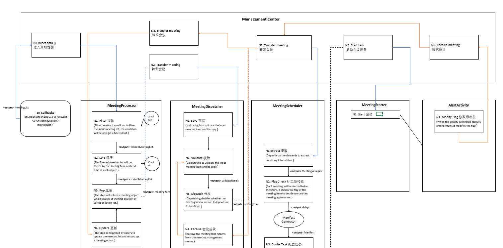
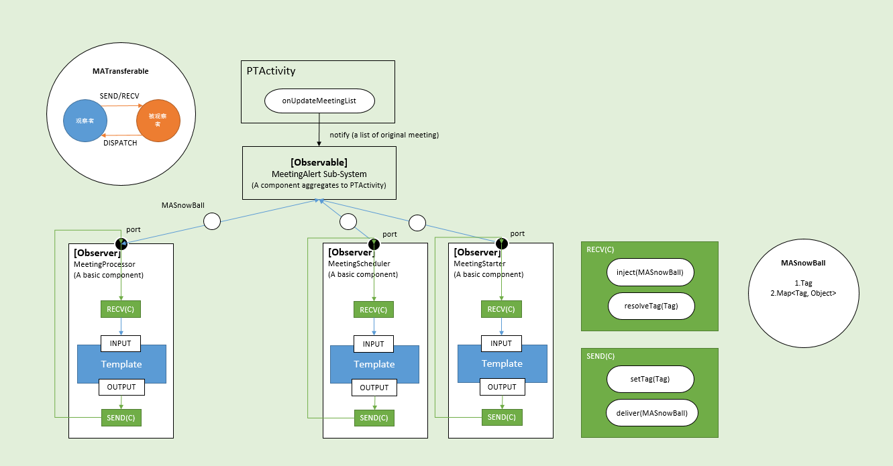
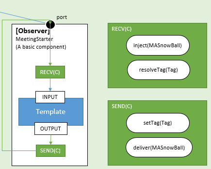
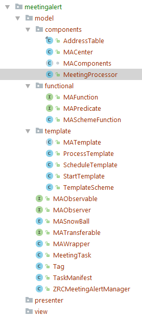
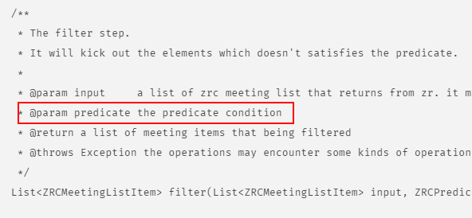
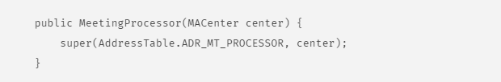
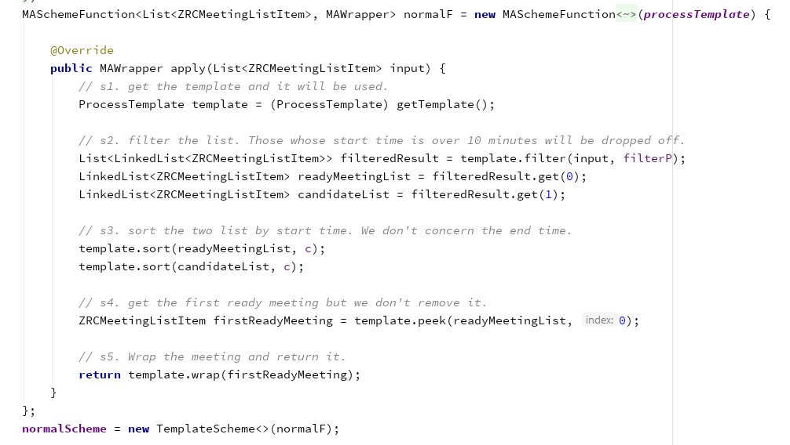

# 重构，我用三次失败换一点经验

今天是2017/12/25，我对圣诞节这样人多的且不知道干什么的节日不是很感兴趣，毅然决然地打开编辑器，聊聊最近做重构的一些内容和感受。况且很久没有写写文章，有点渐行渐远，这是个好机会和自己对对话。

## 什么是重构？
在我进行了一次相对完整的代码重构之前，没有系统地学习过重构的整体要求与细节要求，所以，我的这次代码重构是在非客观性的条件下进行的，可能是我自己意识到原来的代码可读性很低，或者发现了有很多的地方是值得改进的，才进了一次冒险性的重构。

我之所以称**代码重构**是**冒险性的**，是有一定原因的。正如我前面提及的，缺乏重构的经验和意识，这使得我要进行一次代码重构是要耗费时间与很多精力的。结果也正如我验证的一样，我走了很多弯路，试验了很多次，至少3-4次，才算完成一次代码重构。

所以，现在反省过来，要想进行重构，第一个非常重要的因素就是要意识到，我们**是否对代码重构有足够的意识或是了解**。意识？了解？再简化地说，就是，**代码重构的定义**！这就好比是一个指导方针，如果一味盲目地要想进行重构而不断地试错，反而忽略了它的要义，这是得不偿失的。

那什么是代码重构呢？最好的方式就是去GOOGLE一下它的定义。（这里我个人更爱wikiwand，它的定义是准确的）
> Code refactoring is the process of restructuring existing computer code - changing the factoring - without changing its external behavior.

定义就是短短的一句话，但是包含了很多信息。首先，代码重构是一个**过程**。那么一个过程就势必要经历很多个步骤或任务才能达到目的。

- 所以，代码重构不是一步完成的，是要很多步骤甚至是很多次重构才能达到最终目标。

其次，我们看到，changing the factoring without changing its external behavior 这句更加重要。可以将原有内容进行分解，但是不能改变外部结果。

- 这好比一辆车，修理员可以更换内部零件或者整个车体系统，但是，更换的结果是需要和原有的行为保持一致。

有了以上两点的说明和限制，这让我对重构有了进一步的认识。同样，这也会引申出来很多重构的技巧，比如，如何利用设计模式巧妙地解决问题，如何设计测试（单元测试、回归测试）去验证行为的一致性，等。

### 小结

---------------

我在没有事先弄清楚定义的情况下，贸然地选择了对现有代码进行重构，虽然可能代码确实有需要改进的地方，但仔细分析后可以仅仅修改函数或者小范围的修改代码就可以解决问题，那么重构就绝对不是一个好选择，后面我们会说明什么时候进行代码重构，这里只是要强调，要想准备对代码进行一次重构，如果没有概念，那么最好先有些了解。

----------

## 为什么要进行重构？
其实，在这个话题上，仁者见仁智者见智，每个人对重构的理解和进行时机不尽相同，因此，在“为什么”这个问题上，是很难有一个统一的答案。与其问“为什么要进行重构？”，还不如问“重构的意义是什么？”。的确，重构是软件开发中一个非常重要的概念和过程。我一直秉承着有新增加的功能就要进行重构的想法做了很久，这个想法不是很成熟或者是错误的。重构有大有小，有难有易，虽然我们要更在意重构的意义，但是究竟重构的最好时机是什么时候呢？

在Wiki有这样我一句话吸引我了的注意：
> Refactoring is usually motivated by noticing a **code smell**.

Code smell？代码味道？这是什么东西？还别说，真找到了一些官方解释：“**是指源码中可能表示更深层次问题的任何症状。通常对应于系统中更深层次的问题。**”。代码味道给我最深的感受就是，当我要增加新的功能到已有的代码中时，会产生一种堆砌的感觉，对于软件要求的一些特性，如可扩展性、可维护性等没有什么好的体现，同时我会主观地认为增加了这些新的内容极有可能产生问题，这时候我会考虑是否要对代码进行重构。那么，当我们发现有这样的迹象时，可能会是一个重构的时机，但是否是最好还要实践来验证。

重构的意义无一不是为了让代码更好，为了拥有更好的代码，我们使用重构去达到目的，这是很好的手段。重构做的好，会为代码带来更多益处，如果做的不好，则会欠下技术债（technical debt），越累越多。重构的优势在于这两类：

1. **维护性**：可维护性是什么？更好更快的修复bug。有维护性的代码是很易于阅读的且作者的构思与编写更容易理解。实现可维护性可以通过编写良好命名的、单一职责的方法，也可以通过移动一个方法到一个更加合适的类，或移除掉让人误解的注释。

2. **扩展性**：如我们使用更容易理解的设计模式来方便应用的功能拓展，而且它会提供更多的灵活性。

有了这两点，至少我们已经明白，做一次代码重构，肯定要围绕着**维护性**与**拓展性**进行。对于我自己来说，我是有这两点的意识的，便围绕它们开始了第一轮的重构方案设计。虽然指导方针没错，但是我做未必是对的。

在此，我先对于要进行的重构业务简单地做一个说明（以下内容不涉及具体商业内容，均以抽象概念说明）。在现代的会议系统中，为了达到高度的自动化，由传统的人工提醒会议转变为智能提醒，如系统会自动安排会议并在会议即将开始的时候给用户发送消息提醒会议即将开始。老版本的智能会议提醒缺少很多case，考虑的情况很单一，那么经过几次的迭代之后，功能发生了很大的变化，考虑到的用例更多。

此时，代码的结构也发生了很大的变化，从传动的MVC结构转向了Android应用更加适用的MVP结构。因此，我的重构动机是基于代码结构的变化而进行的，无论如何，在我**简单地**分析之后，果断的进行了代码重构，正是这次**简单地**分析，让我走了很多弯路、错路。

重构的好处显而易见，这里不必多说，如果想了解更多，可以参考书籍或者网站。

### 小结

---------------

这里我为代码重构铺下了很多内容，主要以进行重构的时机与重构的优势做的说明。

----------

## 如何做重构？

这是一个靠经验来说服人的话题，虽然我的经验不是很多，但我可以把我遇到的问题阐述出来并解决，这就是经验积累的过程。回头看来，我常以**买鞋**为例子说明我自己遇到的问题。

### 第一次：买鞋最重要的不是鞋，而在于是否足够了解自己和脚。

---------
我们要去商场买一双鞋和在网站上网购一双鞋子，差距在什么地方？差距在于一个能试穿，一个不能。不要认为你足够了解自己和自己的脚，如果不是试穿，你可能永远发现不了你的左右脚是不一样大的。重构亦是如此，你可能会优先在意你的方案是否设计的完成没有瑕疵；会在意你的方案考虑的周全，面面俱到；会在意你的方案是否优雅，用到了哪些先进厉害的技术；考虑这些没有错，但是不是第一选择。如果你过分地在意这些内容，你会发现，**鞋子很漂亮，可穿不上**。我挖的最大的坑就是这个，而经验丰富的人定不会优先考虑的！总不能穿着一双华丽的高跟鞋去参加百米冲刺赛吧。

那么，我们应该先考虑什么呢？业务！业务！业务！重要的事情说三遍。业务是最重要的，首当其冲，没有之一。偏离了业务做的任何设计都是徒劳的，是白白浪费时间和精力的。当我拿到这个功能的开发任务之后，确定了选择重构，我便按照自己的理解设计了一套方案。



总的来说，这套方案的设计是一个比较合理但实现比较复杂的一套方案，我的设想是这样的：
整个会议提醒子系统有两个大部分组成，分别为管理中心（Management Center）和业务组件（Biz Components）。
- 管理中心：负责消息的接受与转发，数据的存储。
- 业务组件：负责各个业务处理流程的实现。
- 设计模式：经过考量，选择了观察者模式、策略模式、模板模式，三种。

管理中心要做的事情比较少，主要为消息转发与数据管理。首先，管理中心承担了被观察者（Observable）的角色，一旦有会议相关事件发生，它会发出消息给相关组件发送消息，这时组件的选择是绝对路径的，也就是说当管理中心拿到消息后它必须要知道转发给谁，我是借鉴了路由的选播路由算法而想到的，这样的好处在于消息的准确性的传达。

我们通过观察者模式让管理中心与组件之间建立起链接，这种链接是单向的，只限于被观察者单向的将消息发送给外部组件，但当组件与管理中心是需要相互通信的，组件要做的是对数据进行加工，比如Processor、Dispatcher、Starter三个组件都是要与管理中心通信的。因此，我们同样需要让组件内部聚合一个管理中心的实例，在必要的时候调用管理中心提供给的api返回处理过的数据。无论方案是否正确，至少目前选用的方案是合理的。

接着说说这个方案的组件们，我们利用Processor来举例，Processor是按照处理序列来说的第一个组件，它会优先拿到会议列表并且完成如下动作：
1. 过滤（filter）
2. 排序（sort）
3. 取值（peek）

过滤：会第一时间根据具体条件过滤掉不合符条件的对象。这里我们选用策略模式进行过滤，将过滤条件抽象成一个策略，提供不同的策略，会过滤掉不同的对象。我们选用模仿`Predicate<T>`的接口自定义接口来完成。

排序：根据时间先后进行排序，这样我们就会得到一个按照时间先后排列的会议队列，便可以按照顺序依次取出。

取值：我们从队列中取出需要的会议对象，但是并不弹出。

这个方案看似井井有条，但是问题很多，首先就是要规避输入输出的类型不统一。经过第一次编码之后，我发现管理中心需要一个统一的Input/Output类型，如果类型不统一，管理中心就需要提供很多个api进行转发或管理数据，这势必会导致实现混乱，极容易出错。也正是过于专注于类型的处理，让我钻了牛角尖，很难观察全局。管理中心要进行转发和管理，同时它还有一个重要的职责。我的系统设计图中，蓝色线条是正向传递，而橘色线条是回调传递。正向传递以一个`List<Meeting>`起开始传递，而回调传递则以一个`Meeting`起开始回调传递，而我又寄希望于组件和管理中心的类型统一，即只有一个输入类型，和一个输出类型。这下可苦恼坏了，我想尽了所有办法，利用泛型与模板加以限制，都会导致偏离航线，南辕北辙，代码越写越糟，刚完成一半便进行不下去了。

### 小结

---------

在我看来，失败的原因在于两点：  
1. 过分在乎系统的设计，设计了一个看似很理想的系统，结果发现无法套用，自己绊了自己。
2. 对于现有业务不够熟悉。对于新的需求不够了解。

当我有这两点问题我便发现了症结，正如标题所说，只有对自己和自己的脚足够了解，才能买一双足够好的鞋子，好不在于光鲜亮丽，不在于价格不菲，而在于适合自己。重构的关键也是这样的，如果不能够了解细枝末节，不能说通每一个细节，那就不要做重构，先稳下来慢慢研究代码，梳理业务，这才是最最重要的第一步。

------

### 第二次：穿了双最舒适的拖鞋去了篮球场打球

------------
有了第一次失败的经验，我意识到了自己的问题，赶紧去找文档。结果发现没有文档！其实现在很多公司，无论大小，是有这样的问题，虽然说是问题，但大家都习以为常了。缺乏文档，会让重构遇到很大的阻力。因为这样会使得开发人员绕很多弯路才能理解一些问题。没有开发文档，对位于我来说是比较难的，没有办法，只有去参考iOS的代码，去一点一点剖析，老前辈们有的比较照顾后辈，增加了很多代码注释和好的代码结构，这样也是很好的，梳理起来也很快，有的则全篇代码，什么也没有。我就是在什么也没有的状态下开展的，总之很难。确切的说，在这样的情况下，我觉得只有QA的人才是最了解系统的，开发人员不是。

经过一个星期左右的时间，我大致梳理了85%的逻辑，没办法，只能硬着头皮往前。



接着，我设计了第二套方案。这个方案，其实依然是失败的。
首先，我规避了第一套方案的问题，统一了输入输出类型。这套方案我参考了**路由组播**的设计原理给出的一套方案。

1. 我依然采用了观察者模式来让管理中心通知组件。但管理中心与组件均实现了`MATransferable`接口。这个接口提供了2个原语，`SEND/RECV`用来执行发送，接受的动作。

```Java
/**
 * {@link MATransferable} is an interface that endows each component with an ability of transferring to other components.
 * In order to keep the rules of transferring, it allows the {@link MASnowBall} to be passed between components.
 * <p>
 * Created by Clever.S on 12/13/2017.
 */

public interface MATransferable {

    /**
     * Send a {@link MASnowBall} instance to someone.
     *
     * @param snowBall an instance of snow ball
     */
    void send(MASnowBall snowBall);

    /**
     * Receive a {@link MASnowBall} instance from someone.
     *
     * @param snowBall an instance of snow ball
     */
    void receive(MASnowBall snowBall) throws Exception;
}
```
同时，所有的传递对象均是`MASnowBall`，顾名思义，它就像一个雪球，每个组件都会处理数据并像外部提供，这个方案的中心思想是：所有的组件和管理中心都会发送和接收消息，接收的类型均为`MASnowBall`，路由组播的含义是发送消息到一组接收端的router中，如果需要此消息，就将其拦截并消耗掉。比如Processor会将会议列表过滤、排序、取值，它的路由线路是
- Processor -> Management Center - > Scheduler

我将每一个Component进行了标号，并注册到一个内存表中，这是一个常量表，记录了组件和它对应的地址。

```Java
public final class AddressTable {

    public final static int ADR_CONSUMED = -1;
    public final static int ADR_PT = 0;
    public final static int ADR_MT_PROCESSOR = 1;
    public final static int ADR_MT_SCHEDULER = 2;
    public final static int ADR_MT_STARTER = 3;
    public final static int ADR_ALERT_ACTIVITY = 4;

    private static final Map<Integer, MAComponents> ADR_MAP;

    static {
        ADR_MAP = new ArrayMap<>();
    }

    public static void put(int address, MAComponents val) {
        if (address == -1 || val == null)
            return;

        ADR_MAP.put(address, val);
    }

    public static MAComponents get(int address) {
        return ADR_MAP.get(address);
    }

    public static void clear() {
        ADR_MAP.clear();
    }
}
```
  因此，在每一个组件初始化的时候，都会将自己注册到这个表格中，并且领到自己的地址。Processor在处理完会议队列后，会将一个即将启动的Meeting发送给Scheduler，它是一个会议调度器，会根据具体的信息安排会议的启动与延迟等。Processor会在`MASnowBall`中揉进这个Meeting并且将目标地址设为需要的Scheduler的的地址（即使只有它需要）。Processor通过`send`方法到整个系统中，需要的组件会验证目标地址是否自己的地址，如果是，便取出`MASnowBall`，解析对应的信息。我利用模板模式整合了组件的内部：
  
  
  
  每一个组件都有一个port，类似于主机的端口号一样，这是标识一个组件的唯一的地址，每一个组件包含三个部分：
  1. 接收：接收组播的消息，包括两个子步骤，注入与解析。
  2. 处理：处理由模板的核心部分来完成，它包含了每个板子的核心处理逻辑。
  3. 发送：重新将消息发送回系统。包含两个子步骤：设置tag与发送。

以上就是第二次设计的方案的核心部分。那为什么说还是失败了呢。


问题在于**场景简单，设计复杂**。事实上，这个问题很好解答，假设我们从A-B地，有N条路，如果时间，各种资源条件允许，我们每条路都试一次，总会找到最短的，风景最好的等等分类。这套方案，我是从头到尾实现了一遍（还有几个组件没放进来）的，虽然大的目标是实现了，但是与系统的契合度不高，也就是说，这个方案把原本业务场景很具体化的案例给抽象化了，一旦我们将系统抽象化，那么势必想所有的事情都要站在一个高度，会考虑的问题很多，虽然说考虑周全没错，但是问题就在于考虑周去的系统会分散注意，会离散组件之间的关联，这与要求的低的耦合性没有什么关系，不是一个问题。

```Java
public interface MAObserver<NT, CT, O> {
    // *******
    O apply(NT input, TemplateScheme<NT, O> scheme);
    
    // *******
    O applyCallback(CT callbackInput, TemplateScheme<CT, O> scheme);
}
```

诸如此类的代码，我将泛型引入到系统后，组件之间的关联性开始变得复杂，徒增难度。

### 小结

----------

方案的好与坏，绝不是看出来的，也不是猜想出来的，是要经过实践的。经过第二次的实践，我发现虽然改掉了第一个方案的诸多问题，但是第二套方案更加复杂，引入了更多的类型限制，增加了很多不必要的内容，这使得我认为这个方案落地不好，不是那么稳当。一定还要进行一次。第二次方案我用了一周的时间初步完成，使用起来很复杂，导致与原本的业务有些偏离，配合的不是很好。同时，前面我们提到，代码重构的核心是要保证可维护性和可拓展性为基础来实现的，这套方案在这两点上的体现不是很好，显得臃肿。

----------

### 第三次：再次分析与瘦身
----------

有了前两次的尝试与总结，第三次的方案确实简化了很多。


相比于方案1和2，这次的方案去掉了很多与系统无关的内容，同时，我不再采用观察者模式去设计系统，彻底分解了组件的概念，简单地利用类的组合来完成目标。同时方案也从MVC调整为MVP结构，我们来对比一下前后的变化：

我们拿MeetingProcessor的源码来分析一下。
```MeetingProcessor
public class MeetingProcessor extends MAComponents {

    // The common process template for processor to select one or more steps from it.
    private static final ProcessTemplate processTemplate = new ProcessTemplate();

    /*
        Prepare two schemes for meeting processor to select one of them.
     */
    private TemplateScheme normalScheme;
    private TemplateScheme callbackScheme;

    // the snow ball passed in
    private MASnowBall mSnowBall;

    {
        /*
            The First Scheme for normal order.
         */

        final Comparator<ZRCMeetingListItem> c = new Comparator<ZRCMeetingListItem>() {
            @Override
            public int compare(ZRCMeetingListItem l, ZRCMeetingListItem r) {
                return 0;
            }
        };
        final MAPredicate<ZRCMeetingListItem> filterP = new MAPredicate<ZRCMeetingListItem>() {
            @Override
            public boolean test(ZRCMeetingListItem zrcMeetingListItem) {
                return false;
            }
        };
        MASchemeFunction<List<ZRCMeetingListItem>, MAWrapper> normalF = new MASchemeFunction<List<ZRCMeetingListItem>, MAWrapper>(processTemplate) {

            @Override
            public MAWrapper apply(List<ZRCMeetingListItem> input) {
                // s1. get the template and it will be used.
                ProcessTemplate template = (ProcessTemplate) getTemplate();

                // s2. filter the list. Those whose start time is over 10 minutes will be dropped off.
                List<LinkedList<ZRCMeetingListItem>> filteredResult = template.filter(input, filterP);
                LinkedList<ZRCMeetingListItem> readyMeetingList = filteredResult.get(0);
                LinkedList<ZRCMeetingListItem> candidateList = filteredResult.get(1);

                // s3. sort the two list by start time. We don't concern the end time.
                template.sort(readyMeetingList, c);
                template.sort(candidateList, c);

                // s4. get the first ready meeting but we don't remove it.
                ZRCMeetingListItem firstReadyMeeting = template.peek(readyMeetingList, 0);

                // s5. Wrap the meeting and return it.
                return template.wrap(firstReadyMeeting);
            }
        };
        normalScheme = new TemplateScheme<>(normalF);

        /*
            The Second Scheme for callback.
         */
        MASchemeFunction<MAWrapper, MAWrapper> callbackF = new MASchemeFunction<MAWrapper, MAWrapper>(processTemplate) {

            @Override
            public MAWrapper apply(MAWrapper input) {
                return null;
            }
        };
        callbackScheme = new TemplateScheme<>(callbackF);
    }

    public MeetingProcessor(MACenter center) {
        super(AddressTable.ADR_MT_PROCESSOR, center);
    }

    @SuppressWarnings("unchecked")
    @Override
    public void receive(MASnowBall snowBall) throws Exception {

        // if there is no need to handle down, just stop and do nothing
        boolean handleDown = inject(snowBall, new MAPredicate<MASnowBall>() {
            @Override
            public boolean test(MASnowBall snowBall) {
                return snowBall != null && snowBall.getCurrentTag() != null;
            }
        });

        if (!handleDown) {
            MASnowBall.WRONG_BALL.setStatus(MASnowBall.WRONG);
            send(MASnowBall.WRONG_BALL);
            return;
        } else {
            mSnowBall = snowBall;
        }

        // the second step to do resolveTag()
        Object val = resolveTag();
        if (val == null) {
            // means that the snow ball is not sent to me.
            MASnowBall.WRONG_BALL.setStatus(MASnowBall.WRONG);
            send(MASnowBall.WRONG_BALL);
            return;
        }

        // the third step is to execute.
        Tag.Case applyCase = snowBall.getCurrentTag().getApplyCase();
        Object result = null;
        switch (applyCase) {
            case NORMAL:
                List<ZRCMeetingListItem> meetingList = (List<ZRCMeetingListItem>) val;
                result = execute(meetingList, normalScheme);
                break;

            case CALLBACK:
                MAWrapper wrapper = (MAWrapper) val;
                result = execute(wrapper, callbackScheme);
                break;

            default:
                break;
        }

        // set tag depends on my requires, that is,
        // the snow ball is handled by MeetingProcessor and sent to where needs it.
        setTag(mSnowBall, result);

        // if MeetingProcessor handles the snow ball, at the end of it, send the handled snow ball to Center again.
        // Some components will receive the snow ball again.
        send(mSnowBall);
    }

    @Override
    public boolean inject(MASnowBall snowBall, MAPredicate<MASnowBall> p) {
        if (p == null)
            return snowBall != null;

        return p.test(snowBall);
    }

    @Override
    public Object resolveTag() {
        if (mSnowBall.getCurrentTag().getTo() != getAddress()) {
            return null;
        }

        // if the snow ball is send to me, i receive it and handle it.
        return mSnowBall.find(mSnowBall.getCurrentTag());
    }

    @Override
    public <I, O> O execute(I input, TemplateScheme<I, O> scheme) {
        // create different apply case
        return scheme.input(input).run();
    }

    @Override
    public void setTag(MASnowBall snowBall, Object output) {
        Tag currentTag = snowBall.getCurrentTag();
        if (currentTag != null) {
            Tag newTag = new Tag();
            newTag.setApplyCase(currentTag.getApplyCase());
            newTag.setFrom(getAddress());

            if (output == null) {
                newTag.setTo(AddressTable.ADR_CONSUMED);
            } else {
                switch (currentTag.getApplyCase()) {
                    case NORMAL:
                    case CALLBACK:
                        newTag.setTo(AddressTable.ADR_MT_SCHEDULER);
                        break;
                }
            }

            snowBall.setStatus(MASnowBall.RIGHT);
            snowBall.setCurrentTag(newTag);
            snowBall.append(newTag, output);
        }
    }

    @Override
    public void send(MASnowBall snowBall) {
        getCenter().dispatch(snowBall);
    }

}
```

```
public interface MAProcessor {

    /**
     * The filter step.
     * It will kick out the elements which doesn't satisfies the predicate.
     *
     * @param input     a list of zrc meeting list that returns from zr. it may be the updated list.
     * @param predicate the predicate condition
     * @return a list of meeting items that being filtered
     * @throws Exception the operations may encounter some kinds of operations. You won't handle it or throw an exception if you don't need it.
     */
    List<ZRCMeetingListItem> filter(List<ZRCMeetingListItem> input, ZRCPredicate<ZRCMeetingListItem> predicate) throws Exception;

    /**
     * The sort step.
     * The function will sort a list of meeting item by a comparator.
     *
     * @param input a list of meeting item
     */
    void sort(List<ZRCMeetingListItem> input);

    /**
     * Get a specific object of {@link ZRCMeetingListItem} which is pointed by param 'where'.
     *
     * @param sortedInput a sorted input meeting list
     * @param where       which element is peeked
     * @return an instance of ZRCMeetingListItem
     */
    ZRCMeetingListItem peek(List<ZRCMeetingListItem> sortedInput, int where);
}
```

以上的代码是完整按照第二/三套方案中的Processor实现的。

第二套方案中的Processor是一个类来实现的，在第三套方案中，我将其抽象为接口，通过提供的三个流程化方案完成了整个processing的任务。同样，我依然使用**策略模式**来为过滤（filter）提供过滤条件。



而在第二套方案中，要在内存的路由地址表中注册Processor组件。




接着，需要利用`Function<I, O>`提供的`apply`方法将输入的`I`类型转换为`O`类型。而正是这种输入输出类型的限制，导致Processor的处理受限制，因为正向处理与回调处理的缘故，我需要提供很多个`Function`才能完成任务。

相比于第二套方案，第三套方案则移除了泛型的限制，函数直接来处理在编译初期就能确定的类型，假设无需证明以后是否会有其他类型参与进来，即使真的有，我们也可以通过继承的方式或者再指定泛型类型的函数来解决问题也不迟。

因此，第三套方案更加适合这个需求，更加轻量。还有，当我们的代码从MVC转向MVP的时候，本身就是一次重构，Activity的角色被重新定义，承担的事务被重新分解，这在编码的层面来说已经是一次很好的重构。

最后，如何保证我的代码与原来的代码出入一致，我们要编写大量的单元测试，做很多次回归测试，来保证。这里我会在接续的文章中说明如何编写这些测试。

## 写在最后

重构绝不止这么简单！我所表述的均是我个人的经历和感受。接下来，我会系统的学一下重构的流程，掌握的更加全面。

**重构给我最大触动就是，任何的重构绝不要肆意进行，进行重构的重中之重就是要对业务有100%的了解，但凡缺少一点，都会引入新的bug或者功能缺失，先不论做的好坏，结果是不允许的，便证明重构是失败的。因此，哪怕多一些时间放在梳理代码，整理出现有代码的结构图，类图，时序图，流程图等，仔细分析它们来找出不足之处，这绝对是值得的。这样的出发点更加偏向于理智，偏向于落地更好，更能解决问题，而不是做了一套全新的架构让后面人的再次推翻重建。**

