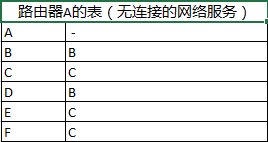
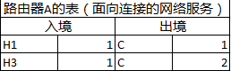

# 利用经典Dijkstra算法实现路由算法优化

## 说明
本篇文章没有个人的独创内容，虽说违背了原创精神，但这是一个学习的过程，将《计算机网络》和《算法（第4版）》其中的内容做了摘要和优化。仅此而已。欲作说明，不喜勿喷。

## 目录
- 路由优化介绍
- （核心）有向加权图讲解
- （核心）最短路径算法讲解
- 利用Dijkstra算法实现路由算法优化

## 路由优化介绍
### 1）什么是路由算法
------
在弄清楚什么是路由算法之前，先来重温一下计算机网络的分层，称为OSI参考模型。

/-/-------------------/  
  7   应用层  
  6   表示层  
  5  会话层  
  4  传输层  
  3  网络层  
  2  数据链路层  
  1  物理层  
  /-/-------------------/  

注意，OSI参考模型本身并不是一个网络体系结构，它没有定义每一层的服务和所应用的协议。OSI只是指明了每一层应该做些什么事情。

**路由算法**主要服务于**网络层**。
> **网络层**的主要功能就是控制子网的运行。同时网络所提供的服务质量（延迟、传输时间、抖动等）也是网络层的问题。

网络层要关注的核心是如何将源端的数据包发送到接收方（receiver），那么对于整个传输的网络，网络层必须要知道这个网络的拓扑结构，并从拓扑结构中选出一条最佳路径作为传输路径来完成数据包的传输。在绝大数的网络中，一个数据包可能会经历很多跳（hop）才会从源端 到接收端，无论是在面向连接的网络中还是无连接的网络中，如何将数据包在最佳路径上传输，这是路由算法专注要解决的问题。

### 2）区分转发与路由
------  
每一个路由器（router）可以被简单地认为有两个进程：**转发（forwarding）进程**和**路由（routing）进程**。这两个进程有实质性的区别。

- 路由进程：生成表与更新表。
- 转发进程：查表。

在一个路由器的内存中可能会存在这样一张表（在面向连接的网络中或无连接的网络中都会生成表，只是表结构不同），它会说明一个数据包从哪里来，到哪里去。无论是路由器的路由进程还是转发进程，都是在对这个表做维护。

  

因此，路由与转发和路由算法息息相关，路由算法会为它们的决策提供依据。